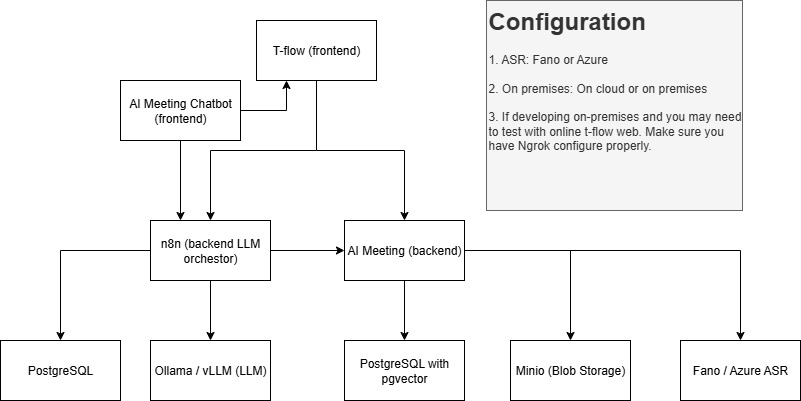

# Docker Compose Offline Installation Guide

This comprehensive script helps you install Docker Compose on offline Ubuntu 22.04 machines where Docker is already installed.

## Features

- ✅ Download Docker Compose binary with checksum verification
- ✅ Auto-detect system architecture (x86_64/aarch64)
- ✅ Transfer files via SCP to remote machines
- ✅ Install on offline machines with safety checks
- ✅ Colored output and progress indicators
- ✅ Error handling and validation
- ✅ Support for custom versions and architectures

## Prerequisites

- **Internet-connected machine**: wget or curl
- **Offline target machine**: Docker already installed
- **For remote transfer**: SSH access with SCP

## Quick Start

### Step 1: Download (Internet-connected machine)
```bash
# Make the script executable
chmod +x install-docker-compose-offline.sh

# Download latest Docker Compose
./install-docker-compose-offline.sh download

# Or download specific version
./install-docker-compose-offline.sh download -v v2.23.3
```

### Step 2: Transfer to Offline Machine
```bash
# Option A: Transfer via SCP
./install-docker-compose-offline.sh transfer -u myuser -h 192.168.1.100

# Option B: Manual transfer
scp -r docker-compose-offline/ myuser@192.168.1.100:/tmp/
```

### Step 3: Install on Offline Machine
```bash
# SSH to offline machine
ssh myuser@192.168.1.100

# Navigate to transferred files
cd /tmp/docker-compose-offline

# Install Docker Compose
./install-on-offline.sh
```

## Complete Usage Examples

### Basic Usage
```bash
# Download latest version
./install-docker-compose-offline.sh download

# Install from local files
./install-docker-compose-offline.sh install
```

### Advanced Usage
```bash
# Download specific version for ARM64
./install-docker-compose-offline.sh download -v v2.24.1 -a aarch64

# Download to custom directory
./install-docker-compose-offline.sh download -d /path/to/downloads

# Transfer with custom remote path
./install-docker-compose-offline.sh transfer -u ubuntu -h 10.0.0.50 -p /home/ubuntu/docker-install

# Install to custom directory
./install-docker-compose-offline.sh install -i /opt/bin
```

## Command Reference

### Commands
- `download` - Download Docker Compose binary (internet required)
- `install` - Install Docker Compose from local binary
- `transfer` - Transfer files to remote machine via SCP
- `help` - Show help message

### Options
- `-v, --version VERSION` - Docker Compose version (default: v2.24.1)
- `-a, --arch ARCH` - Architecture: x86_64 or aarch64 (auto-detected)
- `-d, --download-dir DIR` - Download directory (default: ./docker-compose-offline)
- `-i, --install-dir DIR` - Installation directory (default: /usr/local/bin)
- `-u, --user USER` - Remote username for SCP transfer
- `-h, --host HOST` - Remote hostname/IP for SCP transfer
- `-p, --path PATH` - Remote path for transfer (default: /tmp/docker-compose-install)

## Manual Installation (Alternative)

If you prefer manual installation:

```bash
# On internet-connected machine
wget https://github.com/docker/compose/releases/download/v2.24.1/docker-compose-linux-x86_64 -O docker-compose
chmod +x docker-compose

# Transfer to offline machine
scp docker-compose user@offline-machine:/tmp/

# On offline machine
sudo mv /tmp/docker-compose /usr/local/bin/
sudo chmod +x /usr/local/bin/docker-compose
```

## Verification

After installation, verify Docker Compose works:

```bash
# Check version
docker-compose --version

# Test basic functionality
docker-compose version

# Test with a simple compose file
cat > test-compose.yml << EOF
version: '3.8'
services:
  test:
    image: hello-world
EOF

docker-compose -f test-compose.yml up
```

## Troubleshooting

### Common Issues

**1. Permission Denied**
```bash
# Add user to docker group
sudo usermod -aG docker $USER
newgrp docker
```

**2. Docker Service Not Running**
```bash
# Start Docker service
sudo systemctl start docker
sudo systemctl enable docker
```

**3. Command Not Found**
```bash
# Check if binary is in PATH
echo $PATH
ls -l /usr/local/bin/docker-compose

# Create symlink if needed
sudo ln -sf /usr/local/bin/docker-compose /usr/bin/docker-compose
```

**4. Architecture Mismatch**
```bash
# Check your architecture
uname -m

# Download correct version
./install-docker-compose-offline.sh download -a aarch64  # For ARM64
./install-docker-compose-offline.sh download -a x86_64   # For Intel/AMD
```

### Getting Help

```bash
# Show help
./install-docker-compose-offline.sh help

# Show version
./install-docker-compose-offline.sh download --help
```

## File Structure After Download

```
docker-compose-offline/
├── docker-compose                 # Main binary
├── docker-compose.sha256         # Checksum file (if available)
└── install-on-offline.sh         # Installation script for offline machine
```

## Security Notes

1. **Checksum Verification**: The script automatically verifies checksums when available
2. **HTTPS Downloads**: All downloads use HTTPS from official GitHub releases
3. **No Root Downloads**: Downloads don't require root privileges
4. **Sudo for Install**: Installation requires sudo only for system directory access

## Supported Systems

- **Ubuntu 22.04** (primary target)
- **Ubuntu 20.04** (should work)
- **Debian 11+** (should work)
- **Other Linux distributions** with systemd (may work)

## Version History

- **v2.24.1** - Current default version
- **v2.23.3** - Previous stable version
- **v1.29.2** - Legacy version (if needed for compatibility)

Check [Docker Compose Releases](https://github.com/docker/compose/releases) for latest versions.

## License

This script is provided as-is under MIT license. Docker Compose itself is licensed under Apache 2.0. 