# AI Meeting Minutes - Post-Deployment Configuration Guide

> **Configuration Workflow**: For offline deployments, configure environment variables **first** (Section 1), then deploy services (Section 2), and finally configure integrations (Sections 3-5).

## Access Points After Deployment

- **T-flow**: `{TFLOW_HOST}` (configured in environment variables)
- **FANO ASR**: `{FANOLAB_HOST}` (configured in environment variables)
- **AI Meeting Backend**: http://localhost:8001 (or 8000) (mapped from container port 8000)
- **Frontend Chatbot Application**: http://localhost:3001 (or 3000) (mapped from container port 3000)
- **n8n Workflows**: http://localhost:5678
- **MinIO Console**: http://localhost:9001
- **PgVector Database**: localhost:5434

---

## 1. Environment Variables Configuration (Pre-Deployment Setup)

> **Important**: For offline deployments, configure environment variables **before** packing the project into a tar file. This ensures all services start correctly when deployed.

### 1.1 Copy and Configure Environment Template

Copy the environment template and configure it for your deployment:

```bash
# Copy template (if available)
cp .env.template .env
```

### 1.2 Required Environment Variables

Update the following variables in your `.env` file according to your deployment environment

### 1.3 For Offline Deployment

**Before creating the offline package:**

1. Ensure your `.env` file is properly configured with all required variables
2. Test the configuration locally if possible  
3. The `.env` file will be automatically included in your offline package

```bash
# Create offline package with configured environment
./offline-package.sh  # This will include your configured .env file
```

---

## 2. Deploy Docker Compose Services

### 2.1 Start Docker Compose Services

With your `.env` file properly configured, start the Docker Compose services:

```bash
# For CPU-only deployment
docker-compose --profile cpu up -d

# For NVIDIA GPU deployment
docker-compose --profile gpu-nvidia up -d

# For AMD GPU deployment  
docker-compose --profile gpu-amd up -d

# For deployment without Ollama (external LLM)
docker-compose --profile no-ollama up -d
```

### 2.2 Verify Docker Compose Services Deployment

#### **Check Service Status**

Ensure all services are running successfully:

```bash
# Check all running containers
docker-compose ps

# Check service health status
docker-compose ps --format "table {{.Name}}\t{{.Status}}\t{{.Ports}}"
```

**Expected Services:**
- `ai_meeting_backend` - Running, port 8001:8000
- `ai_meeting_chatbot_frontend` - Running, port 3001:3000
- `n8n` - Running, port 5678:5678
- `postgres` - Running, port 5433:5432
- `pgvector` - Running, port 5434:5432
- `minio` - Running, ports 9000:9000, 9001:9001
- `ollama-*` (if using profile) - Running, port 11434:11434

#### **Service Health Checks**

Verify each service is responding:

```bash
# Backend health check
curl -f http://localhost:8001/health

# n8n availability
curl -f http://localhost:5678

# MinIO health check
curl -f http://localhost:9000/minio/health/live
```

#### **View Service Logs**

If any service fails, check the logs:

```bash
# View all logs
docker-compose logs -f

# View specific service logs
docker-compose logs -f ai_meeting_backend
docker-compose logs -f n8n
docker-compose logs -f ollama-cpu  # or ollama-gpu, ollama-gpu-amd
```

### 2.3 Apply Environment Changes (If Needed)

If you need to update environment variables after deployment:

```bash
# Stop services
docker-compose down -v

# Start services with updated environment
docker-compose up -d --force-recreate
```

### 2.4 Troubleshooting Common Issues

**If services fail to start:**
1. **Check disk space**: `df -h`
2. **Check memory usage**: `free -h` 
3. **Verify ports are available**: `netstat -tulpn | grep -E '(8001|3001|5678|9000|9001|5433|5434|6333|11434)'`
4. **Force recreate containers**: `docker-compose down -v && docker-compose up -d --force-recreate`

---

## 3. LLM Installation and Configuration

### 3.1 Option A: Using Ollama (Recommended for Local Setup)

**If using Docker Compose profiles (already configured):**

The Docker Compose setup includes Ollama with different hardware profiles. If you started services in Section 2 with a profile, Ollama should already be running.

**Pull additional models after deployment:**

```bash
# Pull specific models
docker exec ollama ollama pull llama3.2
docker exec ollama ollama pull deepseek-r1:70b

# List available models
docker exec ollama ollama list

# Interactive session for multiple commands
docker exec -it ollama /bin/sh
```

### 3.2 Option B: External Ollama Installation

If you prefer to install Ollama separately:

```bash
# Install Ollama on host system
curl -fsSL https://ollama.ai/install.sh | sh

# Start Ollama service
ollama serve

# Pull required models
ollama pull llama3.2
ollama pull qwen2.5:7b
```

**Update environment variables for external Ollama:**
```bash
# In your .env file
OLLAMA_HOST=localhost:11434  # or your external Ollama host
```

### 3.3 Option C: Using vLLM (Advanced Setup)

For high-performance deployment with vLLM:

```bash
# Install vLLM
pip install vllm

# Run vLLM server
python -m vllm.entrypoints.openai.api_server \
    --model microsoft/DialoGPT-medium \
    --host 0.0.0.0 \
    --port 8000

# Update environment variables
OLLAMA_HOST=localhost:8000  # Point to vLLM endpoint
```

### 3.4 Verify LLM Connection

Test the LLM connection:

```bash
# Test Ollama connection
curl http://localhost:11434/api/tags

# Test via backend service
curl -X POST http://localhost:8001/api/test-llm \
  -H "Content-Type: application/json" \
  -d '{"message": "Hello, test connection"}'
```

---

## 4. Configure n8n Workflows

### 4.1 Access n8n Interface

1. Open n8n in your browser: http://localhost:5678
2. Create initial admin account if prompted
3. Import demo workflows (should be automatically imported)

### 4.2 Configure AI Meeting Minutes Workflow

The demo workflow `AI Meeting Minutes - CMHK ON PREMISE` should be pre-imported. Configure the following:

1. **Activate the workflows**: Ensure all target workflows are activated before configuration:
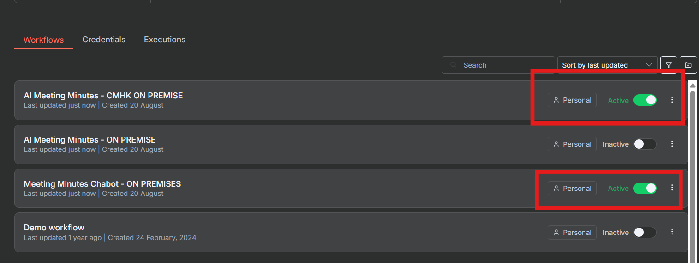


#### **Update T-Flow Nodes:**
1. Locate all `[T-flow]` nodes in the workflow
2. Update the following settings for each T-Flow node:
   - **Host URL**: Update to your T-Flow instance (use `TFLOW_HOST` from environment variables)
   - **App ID**: Configure your T-Flow application ID
   - **Sign ID**: Configure your T-Flow signature ID

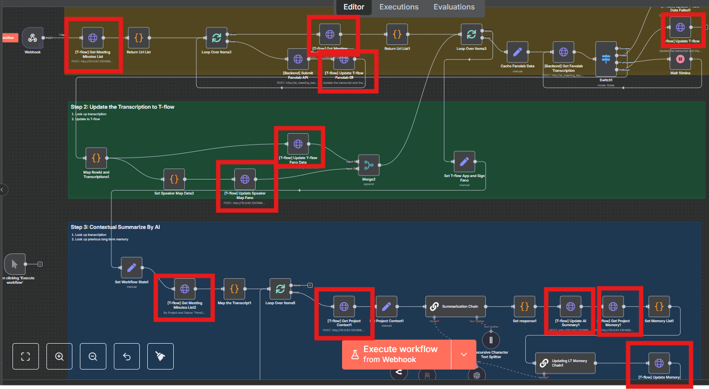
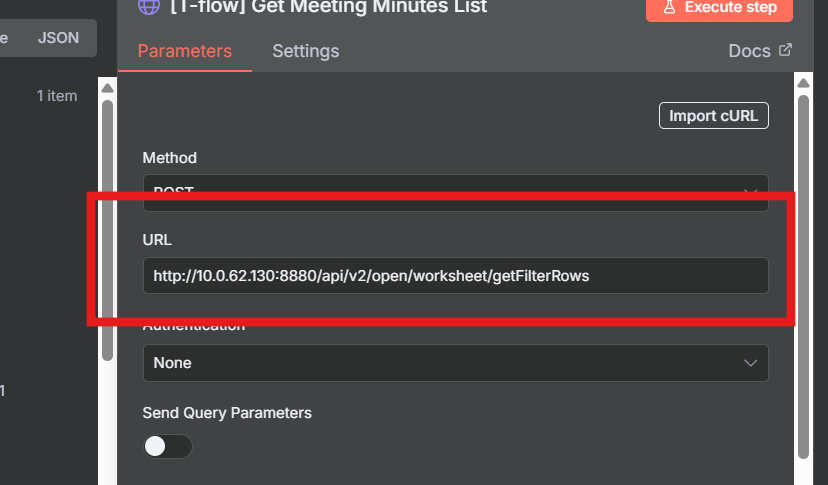


#### **Verify LLM Connection:**
1. Locate the Ollama/OpenAI LLM nodes (if using vLLM, configure OpenAI nodes)
2. Ensure they point to the correct LLM endpoint:
   - **Host**: `ollama:11434` (internal Docker network) or `localhost:11434` (external)
   - **Model**: Verify the model name matches your pulled models (e.g., `llama3.2`, `deepseek-r1:70b`)

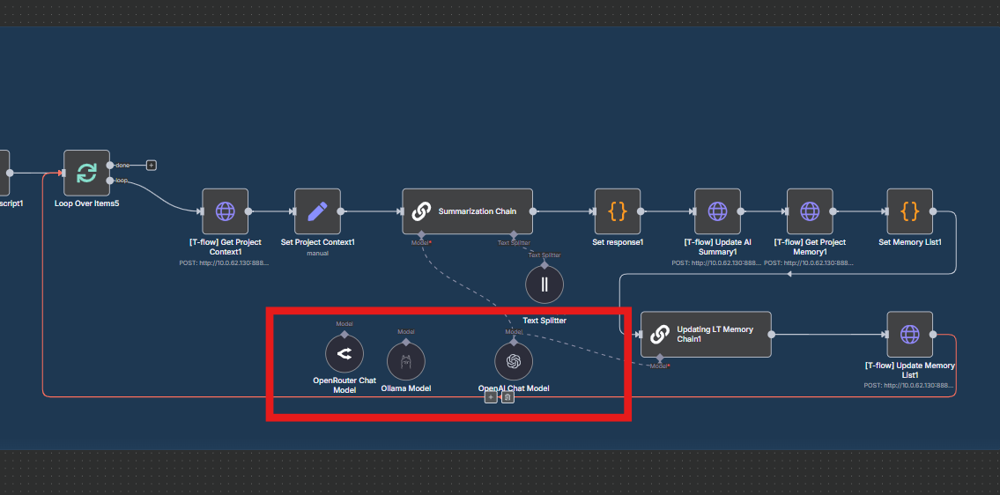

**For vLLM, if using OpenAI format LLM, you may use the OpenAI Chatbot node**

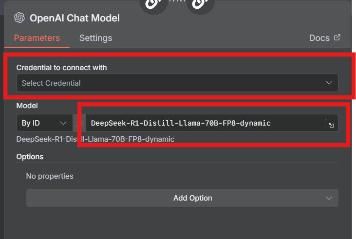

**API Key field - just input 'EMPTY'**

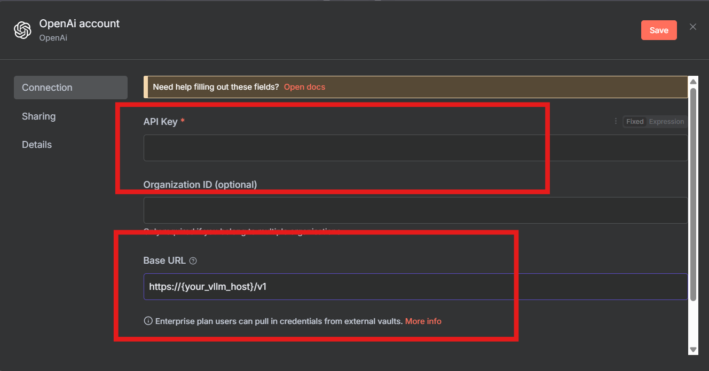

**For ollama, just use the ollama node**

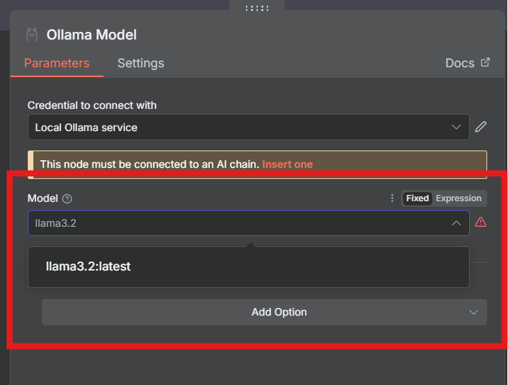

#### **Test LLM Connection:**
1. Create a simple LLM chain using the configured nodes in n8n
2. Connect to your local LLM and perform a test run with a chat trigger to verify functionality

### 4.3 Configure Meeting Minutes Chatbot Workflow

Configure the `Meeting Minutes Chatbot - CMHK ON PREMISES` workflow:

#### **Update Frontend Configuration:**
1. Copy the chatbot webhook ID from the workflow
2. Update your `.env` file with the webhook ID:
```bash
VITE_N8N_WEBHOOK_ID=your-chatbot-webhook-id
# Default value: 8e7676c3-8d0b-47ee-9b68-7ab51848f0ec
```
3. Restart the frontend service to apply changes:
```bash
docker-compose restart ai_meeting_chatbot_frontend
```

### 4.4 Workflow Testing

Test the chatbot workflow functionality:

```bash
# Test chatbot workflow by accessing the frontend
# Open browser and navigate to:
http://localhost:3001/?webhook_id={your-n8n-chatbot-webhook_id}

# Example URL:
http://localhost:3001/?webhook_id=8e7676c3-8d0b-47ee-9b68-7ab51848f0ec
```

**Expected Results:**
- The chatbot interface should load successfully
- You should be able to send test messages and receive responses

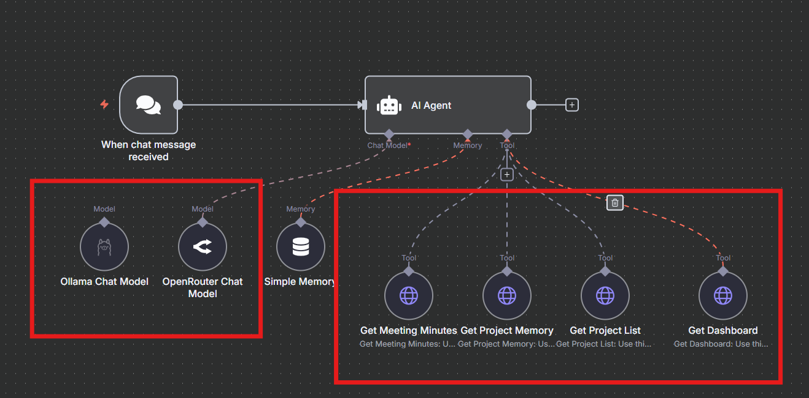
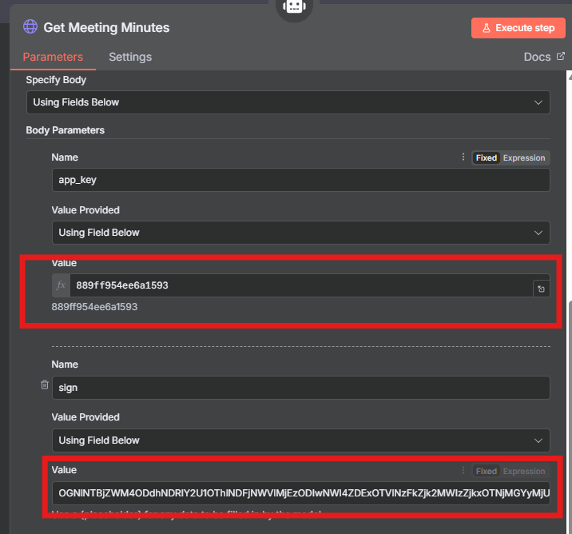

---

## 5. Configure T-Flow

### 5.1 Access T-Flow Interface

Access your T-Flow instance at the configured `TFLOW_HOST` URL.

### 5.2 Update Workflow Configuration

#### **Backend Host URL Configuration:**
1. Navigate to your T-Flow workflow configuration section
2. Update the backend API endpoint settings:
   - **Backend URL**: Set to `http://your-backend-host:8001`
   - **API Endpoints**: Ensure all endpoints point to the correct backend services

#### **API Parameters Configuration:**
1. Configure the authentication parameters:
   - **App ID**: Set your unique application identifier
   - **Sign ID**: Set your signature identifier for API authentication
2. Update any additional API keys or authentication tokens required for backend communication

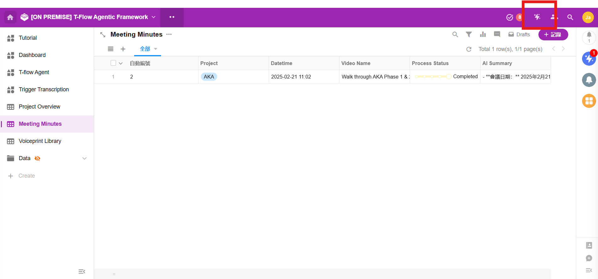
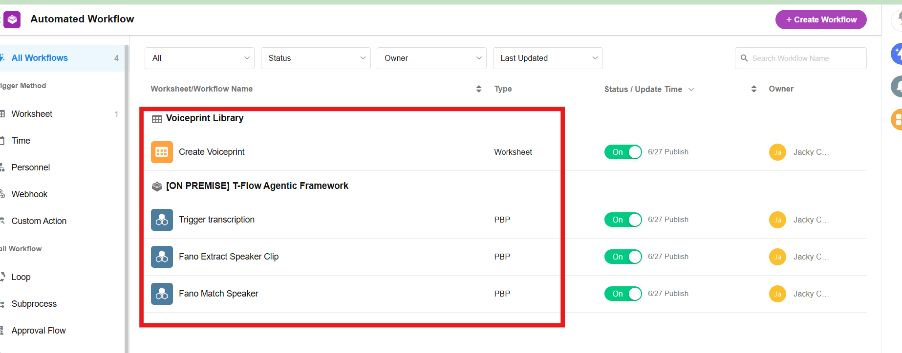
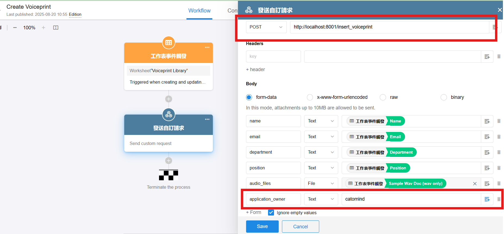
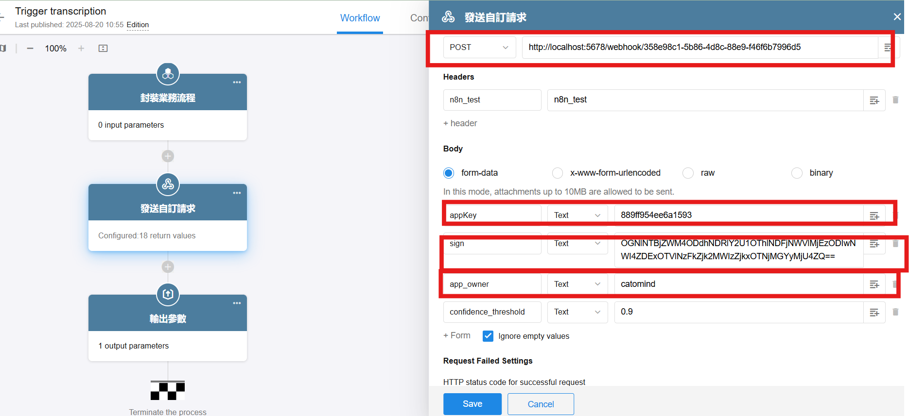
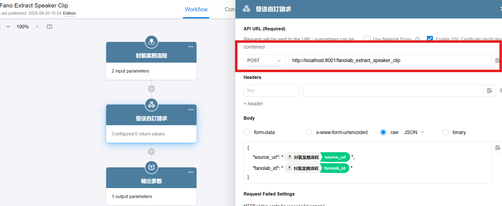
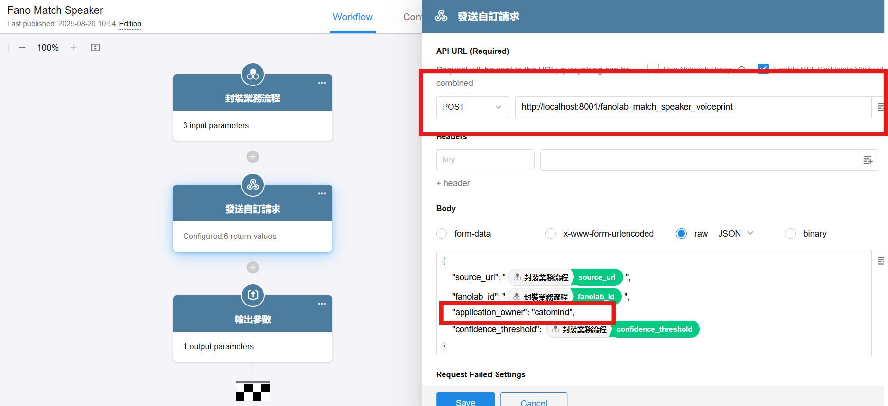

### 5.3 Update Worksheet Configuration

#### **Chatbot Integration Setup:**
1. Navigate to the worksheet settings in T-Flow
2. Configure the chatbot webhook integration:
   - **Webhook URL**: Set to `http://localhost:5678/webhook/{VITE_N8N_WEBHOOK_ID}`
   - **Webhook ID**: Use the same ID configured in your frontend environment variables

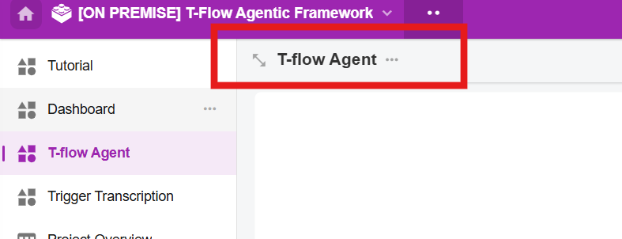
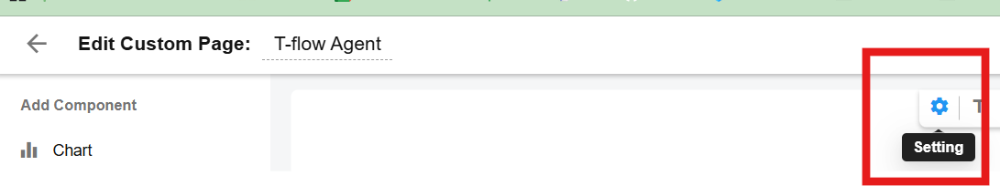
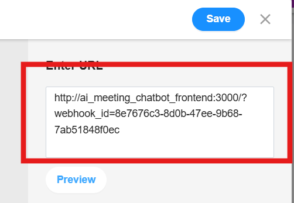

#### **AI Meeting Integration Setup:**
1. Configure the AI meeting workflow endpoint connection
2. Ensure the T-Flow workflow can successfully communicate with the n8n meeting minutes workflow

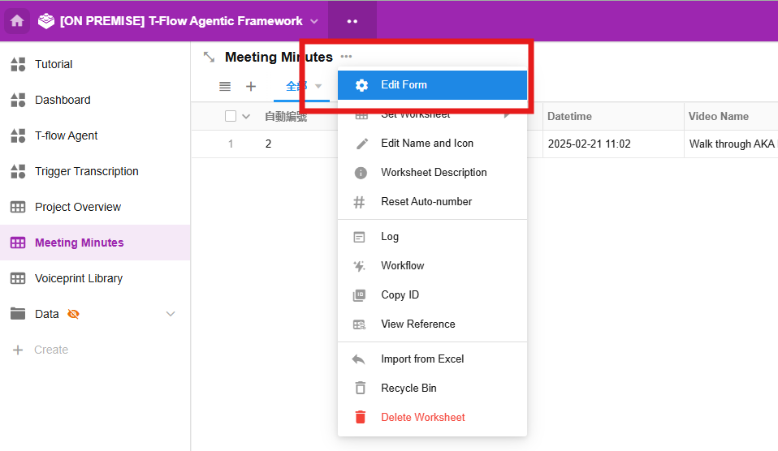
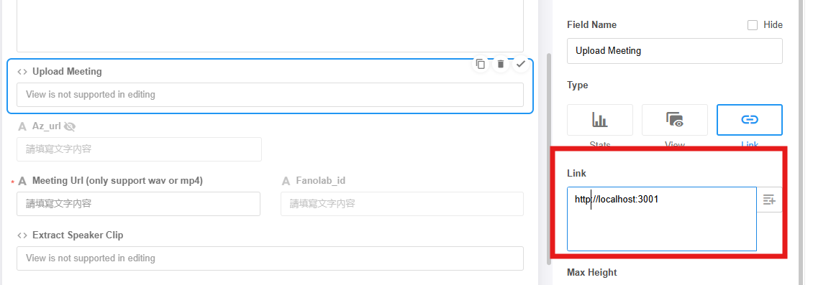

### 5.4 Test T-Flow Integration

Verify that T-Flow can successfully communicate with your services:

#### **Testing Procedure:**
1. **Watch the tutorial video** to understand the complete workflow
2. **Upload test meeting audio**: Upload a sample meeting audio file through T-Flow
3. **Trigger transcription**: Initiate the transcription process to test the complete workflow
4. **Monitor execution**: 
   - **Success**: If the workflow executes successfully, the status will change to "Completed"
   - **Failure**: If issues occur, check the n8n execution logs to identify and debug the problematic components

#### **Troubleshooting:**
- Review n8n workflow execution logs for detailed error information
- Verify all webhook endpoints are accessible
- Confirm LLM models are properly loaded and responding

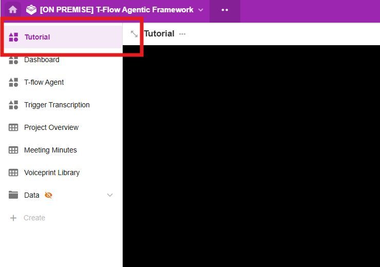
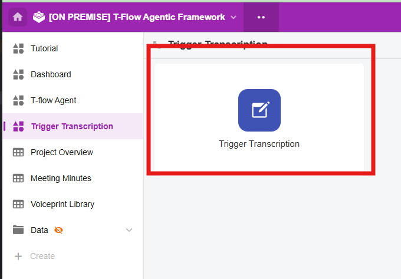
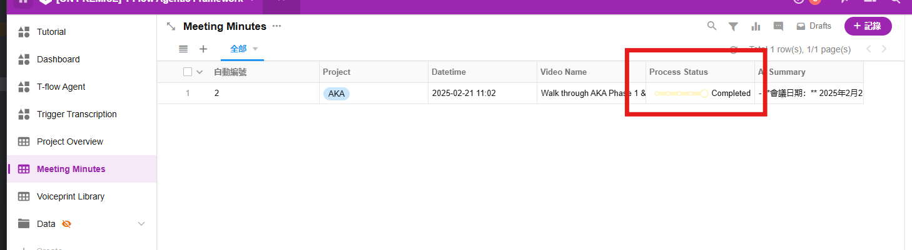


**Failure: If issues occur, check the n8n execution logs to identify and debug the problematic components**

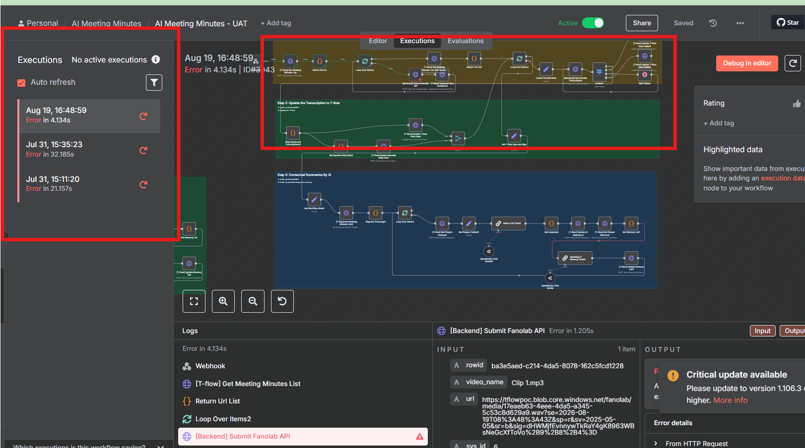
---

## 6. Final Verification

### 6.1 End-to-End Testing

1. **Upload a test audio file** through T-Flow
2. **Verify processing** in n8n workflows
3. **Check results** in the backend system
4. **Test chatbot** functionality via frontend

### 6.2 Monitor Service Logs

Keep monitoring logs for any errors:

```bash
# Monitor all services
docker-compose logs -f

# Check specific integrations
docker-compose logs -f ai_meeting_backend
docker-compose logs -f n8n
```

### 6.3 Performance Optimization

For production deployment:

1. **Adjust resource limits** in `docker-compose.yaml`
2. **Configure log rotation** settings
3. **Set up monitoring** and alerting
4. **Backup configuration** and data volumes

---

## 7. Backup and Maintenance

### 7.1 Backup Data Volumes

```bash
# Backup all data volumes
docker run --rm -v ai_meeting_starter_kit_pgvector_data:/data -v $(pwd):/backup alpine tar czf /backup/pgvector_backup.tar.gz -C /data .
docker run --rm -v ai_meeting_starter_kit_n8n_storage:/data -v $(pwd):/backup alpine tar czf /backup/n8n_backup.tar.gz -C /data .
docker run --rm -v ai_meeting_starter_kit_minio_data:/data -v $(pwd):/backup alpine tar czf /backup/minio_backup.tar.gz -C /data .
```

### 7.2 Export n8n Configurations

```bash
# Export workflows and credentials
docker exec -it n8n n8n export:credentials --backup --output=/home/node/.n8n/exports/
docker exec -it n8n n8n export:workflow --backup --output=/home/node/.n8n/exports/
```

---

## Troubleshooting

### Common Issues and Solutions

1. **Services won't start**: Check port conflicts and available resources
2. **LLM connection issues**: Verify Ollama is running and accessible
3. **Database connection errors**: Check PostgreSQL credentials and network connectivity
4. **Webhook timeouts**: Increase timeout settings in n8n workflow nodes
5. **MinIO access issues**: Verify MinIO credentials and network configuration

### Getting Help

- Check service logs: `docker-compose logs -f [service-name]`
- Verify environment variables: `docker-compose config`
- Test network connectivity: `docker exec [container] ping [target]`

For additional support, refer to the service-specific documentation or contact your system administrator.
